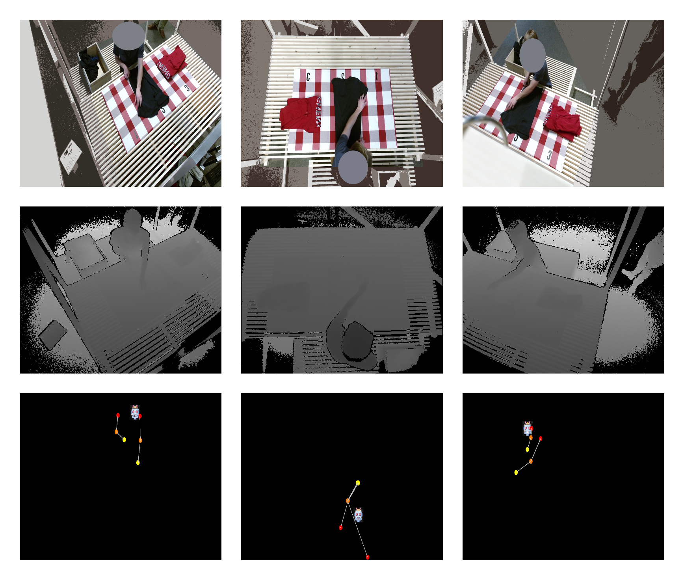

# Folding demonstrations - wiki and code 
This repository contains the home website and API for the Video Dataset of Human Demonstrations of Folding Clothing For Robotic Folding.
The API gives easy access to the video dataset by providing an interface to query RGB images, depth frames, pose coordinates, subtask labels and multiple labelled annotations.  

Detailed information can be found in the [wiki](https://adverley.github.io/folding-demonstrations/).



## Using the dataset and API 

### Requirements
The API of folding_demonstrations works on **Python 3.6** and higher. This is because f-strings are used. The sole dependency is pillow which can be installed using `pip install pillow`.

### Install

To install the package:

```
cd /path/to/folding_demonstrations
pip install . 
```

Or optionally pip install from the git repo:
```
pip install git+git://github.com/adverley/folding-demonstrations.git
```

### Downloading the data
Download the data [here](https://adverley.github.io/folding-demonstrations/#downloads) and extract the files.


### Running examples
To run the examples, cv2 and numpy will also need to be installed.  
```
pip install opencv-python
pip install numpy
```

Run an example with following command:
```
python examples/play_sample.py '/home/to/the/data' --sample_id=43 --perspective='left' 
```

### Usage
The dataset can be loaded with following commands:
```
from folding_demonstrations.dataset import FoldingDemonstrationDataSet

home_dir = '/data/media/folding_demonstrations'
dataset = FoldingDemonstrationDataSet(home_dir)
```
and data can be easily queried with for example
`data[sample_id][frame_nr]['left']['rgb']`. 

All the data that can be sampled can be seen in the example `examples/query_all_data.py`

## Wiki
The project and code documentation can be found on [this](https://adverley.github.io/folding-demonstrations/) page. 
You can run the wiki yourself by running `mkdocs serve` in the root directory of this project. 

The wiki is powered by [MkDocs](https://www.mkdocs.org).


