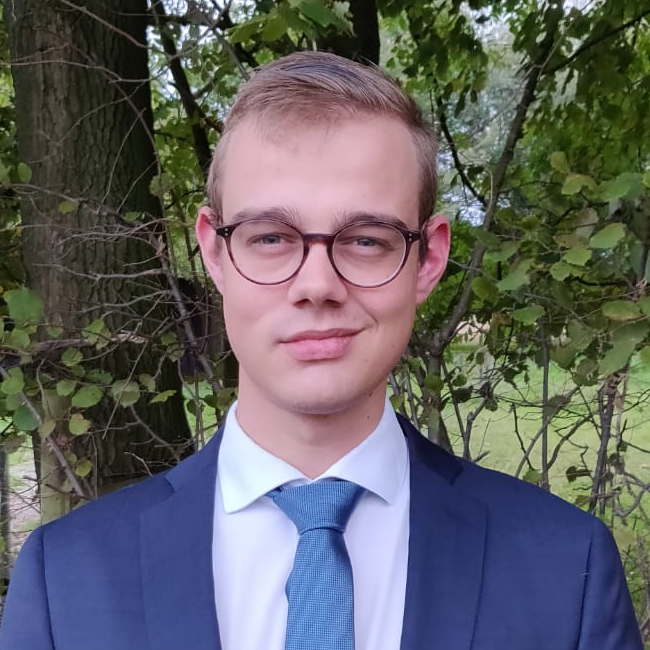
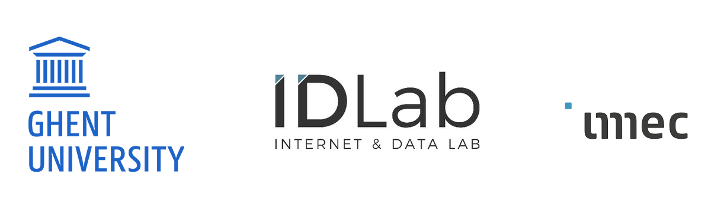

# About

## AIRO

The authors are affiliated with IDLab AIRO, imec at Ghent University.  

{: class=""}

## Authors

{: width=200 height=200 class="rounded-circle mr-3 wx-64"}
### Andreas Verleysen

Andreas is a candidate PhD student at Ghent university. He researches how robots can learn to manipulate highly deformable objects in a scaffolded way by observing human examples. 

{: width=200 height=200 class="rounded-circle mr-3 wx-64"}
### Matthijs Biondina

Bachelor Artificial Intelligence Radboud University Nijmegen, Master in Computing Science with specialization in Data Science at Radboud University Nijmegen. 
Currently specializing in robotics at Ghent University. Future candidate PhD student at Ghent University.  

{: width=200 height=200 class="rounded-circle mr-3 wx-64"}
### Francis wyffels

Francis wyffels (Ghent University - IDLab-AIRO) is an early career professor with expertise in the domain of machine learning and robotics. Additionally, he has expertise in designing smart products and works on unconventional computing. Apart from his research, he strongly believes in dissemination activities. By means of international projects with children, students, and schools, he wants to ensure a more realistic perspective on what robotics can achieve, and reduce the almost innate fear for robotics.

