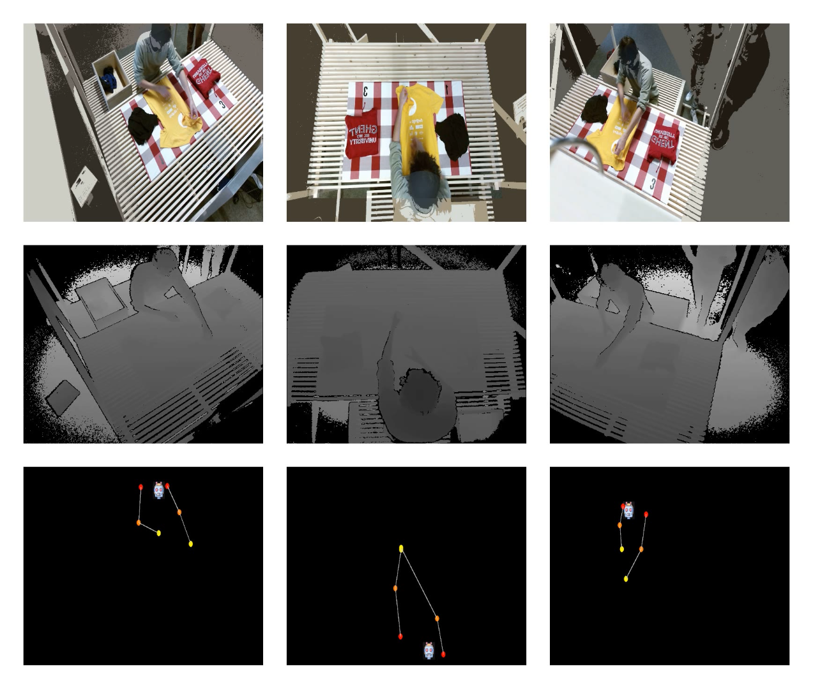
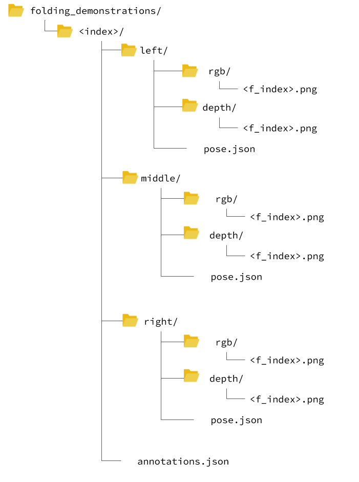

# Video Dataset of Human Demonstrations of Folding Clothing For Robotic Folding
Andreas Verleysen, Matthijs Biondina and Francis wyffels
{: style=font-size:20px;line-height:2.0px;}

IDLab-AIRO, Ghent University-imec 
{: style=font-size:10px;line-height:1.6px;}

Radbout University, Netherlands
{: style=font-size:10px;line-height:0.8px;}

<iframe width="785" height="500" src="https://www.youtube.com/embed/cvXWJV1rsok" frameborder="0" allow="accelerometer; autoplay; encrypted-media; gyroscope; picture-in-picture" allowfullscreen></iframe>

## Introduction
General-purpose cloth folding robots do not yet exist due to the deformable nature of textile,
making it hard to engineer manipulation pipelines or learn this task.
In order to accelerate research for the learning of the robotic folding task, 
we introduce a video dataset of human folding demonstrations.
In total, we provide 8.5 hours of demonstrations from multiple perspectives leading to 1.000 folding samples 
of different types of textiles. The demonstrations are recorded on multiple public places, 
in different conditions with random people. Our dataset consists of anonymized RGB images, 
depth frames, skeleton keypoint trajectories, and object labels.

## Features 
The folding demonstrations in this dataset are exposed using the following features:
 
* RGB frames 
* Depth values
* Skeleton keypoint trajectories
* Subtask labeling
* Descriptive labels such as folding method and type of textile being folded  

## Downloads
The following downloads are available:

 * [Paper](:TODO)
 * [Dataset - 5% sample (3.2 GB)](https://cloud.ilabt.imec.be/index.php/s/6nFYT4HdceKQeBZ)
 * [Dataset - 20% sample (132 GB)](https://cloud.ilabt.imec.be/index.php/s/Grgwri7fa6iM4f6)
 * [Dataset - complete](): this link is upcoming 
 * [Code](https://github.com/adverley/folding-demonstrations)
 
## Directory hierarchy
 The samples are split and organized per folding demonstration of one piece of textile. 
 {:  style="max-width: 60%;"}

 

