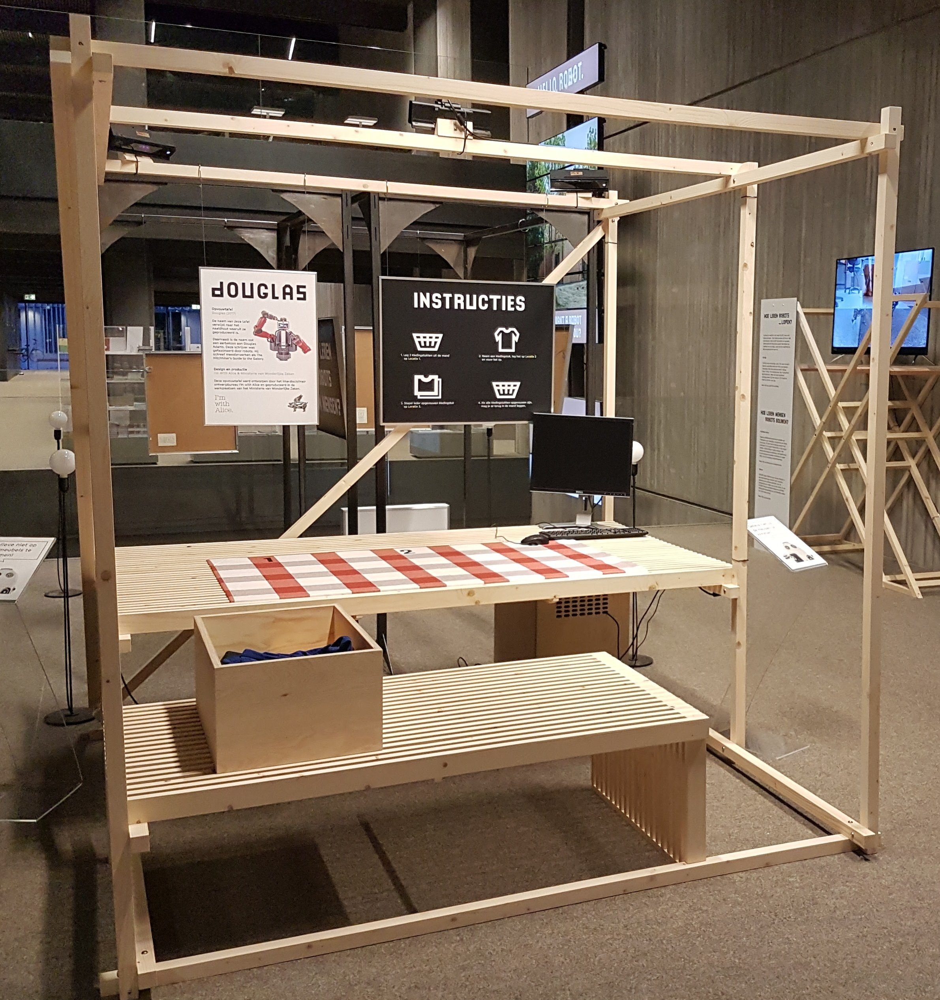
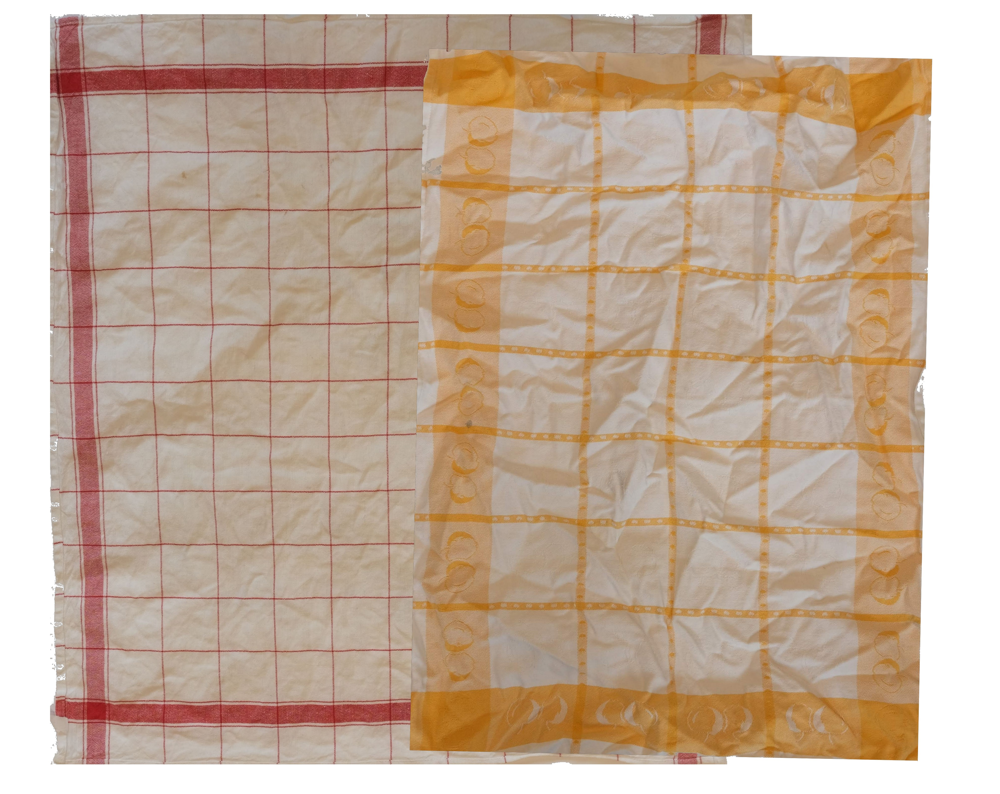
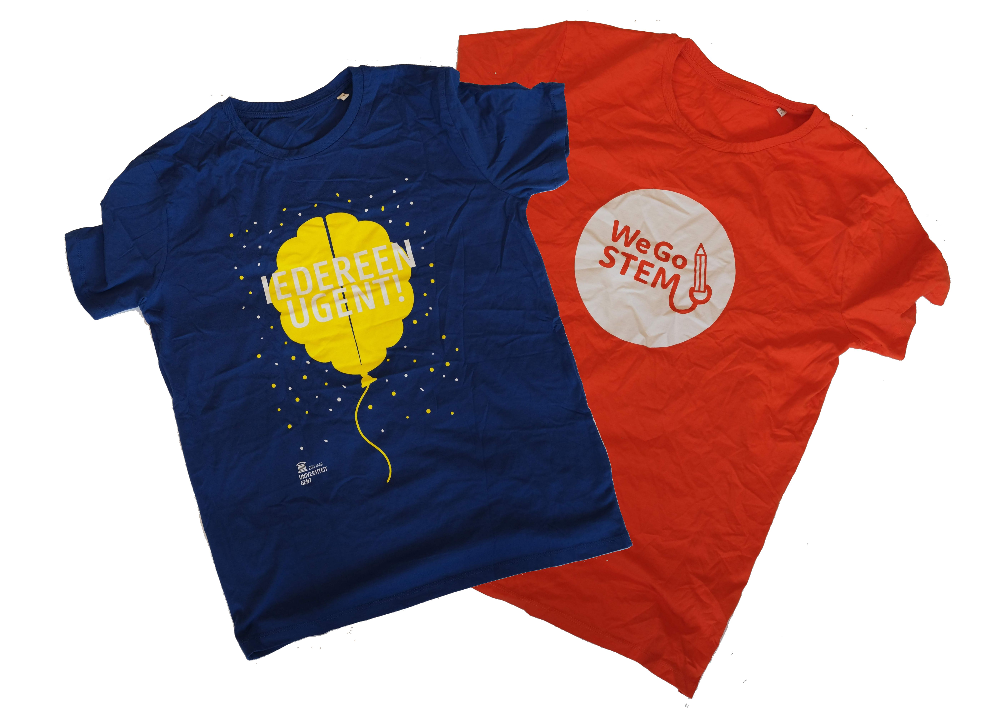
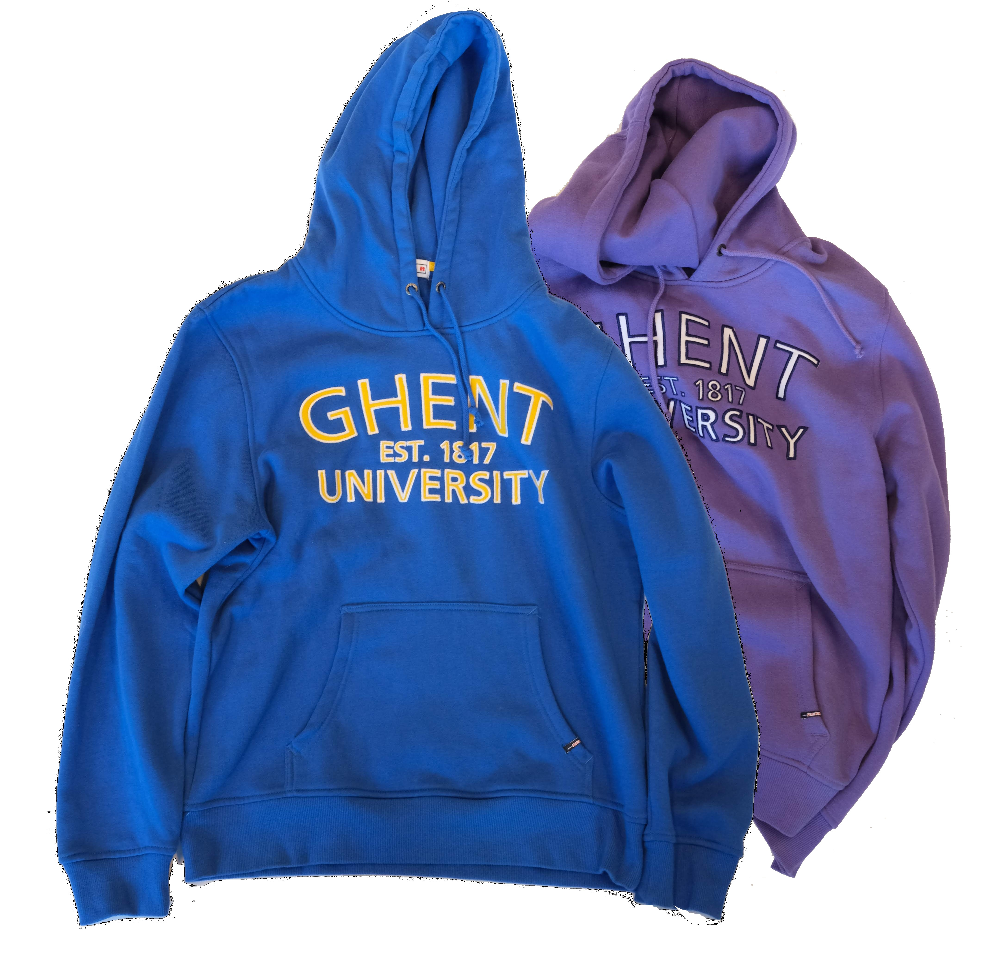

# Setup

## Douglas - our folding table
A folding table with cameras mounted on top was designed and constructed for the purpose of capturing video demonstrations. 

## Types of textile 
There are three different types of textile in the dataset that has to be folded: towels, shirts and hoodies. 

## Anonymization
All RGB frames are anonymized by applying color quantization to the corners of the frame 
and on a patch around the face of the demonstrator. This hides facial features without compromising image fidelity. 

